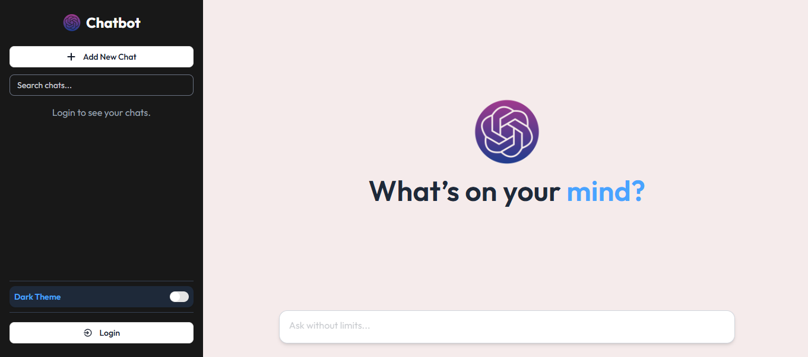

# SmartGPT - AI Chatbot & Image Generator

Chatbot is a full-stack AI platform that leverages Google Gemini to generate intelligent, context-aware responses. Built with React and TailwindCSS on the frontend and Node.js, Express, and MongoDB on the backend, it features a secure authentication system ensuring only registered users can access their chat history, with all conversations stored in their account for future reference.




## Table of Contents

- [Live Demo](#live-demo)
- [Features](#features)
- [Tech Stack](#tech-stack)
- [Project Structure](#project-structure)
- [Getting Started](#getting-started)
- [API Endpoints](#api-endpoints)
- [Contributing](#contributing)

## Live Demo

[SmartGPT App](https://chatbot-client-theta.vercel.app/) - Try the live application

## Features

### Secure Authentication

- Register and login using name, email and password.
- Passwords are encrypted with bcrypt for security.
- JSON Web Token (JWT) is used for authentication.
- Without login, no user can access any feature.

### AI Chat Assistant

- Generate AI-powered responses for any text prompt.
- Works like ChatGPT, giving intelligent answers instead of simple messaging.
- Each conversation is saved securely in the user's account.

### Chat Management

- **Search Chats** – Find specific conversations quickly.
- **Delete Chats** – Remove unwanted chats individually.
- **Chat History** – Access your past prompts and responses anytime.

### Dark / Light Mode

- Switch seamlessly between dark and light themes.

## Tech Stack

### Frontend

| Technology      | Purpose                     |
| --------------- | --------------------------- |
| React           | UI library                  |
| JavaScript      | Language                    |
| Vite            | Build tool and dev server   |
| React Router    | Client-side routing         |
| Redux Toolkit   | State management            |
| Redux Persist   | Local storage persistence   |
| Axios           | HTTP client                 |
| Tailwind CSS    | Utility-first CSS framework |
| shadcn/ui       | Accessible UI components    |
| React Hook Form | Form management             |
| Zod             | Schema validation           |
| React Markdown  | Markdown rendering          |
| PrismJS         | Syntax highlighting         |
| React Hot Toast | Toast notifications         |

### Backend

| Technology                | Purpose               |
| ------------------------- | --------------------- |
| Node.js                   | Runtime environment   |
| JavaScript                | Language              |
| Express.js                | Web framework         |
| MongoDB + Mongoose        | Database and ODM      |
| Google Gemini AI          | Chatbot functionality |
| ImageKit                  | Image storage         |
| JWT                       | Authentication        |
| Swagger UI                | API documentation     |
| Express OpenAPI Validator | Request validation    |
| bcryptjs                  | Password hashing      |
| Morgan                    | Logging               |
| CORS                      | Cross-origin requests |
| dotenv                    | Environment variables |

## Project Structure

```
chatbot/
├── backend/                 # Express.js backend API
│   ├── src/
│   │   ├── api/v1/
│   │   │   ├── auth/        # Auth controllers & routes
│   │   │   ├── chat/        # Chat controllers & routes
│   │   │   ├── message/     # Message controllers & routes
│   │   │   └── user/        # User controllers & routes
│   │   ├── config/          # Gemini, ImageKit, OpenAI configs
│   │   ├── db/              # Database connection
│   │   ├── lib/             # Utility functions
│   │   ├── middleware/      # Auth middleware
│   │   ├── model/           # Mongoose models
│   │   ├── routes/          # API routes
│   │   ├── utils/           # Helpers
│   │   ├── app.js           # Express app
│   │   └── index.js         # Entry point
│   ├── swagger.yaml
│   ├── vercel.json
│   └── package.json
│
└── frontend/             # React frontend application
    ├── src/
    │   ├── api/            # Axios instance
    │   ├── assets/         # Static assets
    │   ├── components/
    │   │   ├── ui/         # shadcn components
    │   │   ├── sidebar/    # Sidebar components
    │   │   └── *.jsx       # Main components
    │   ├── features/       # Redux slices
    │   ├── hooks/          # Custom hooks
    │   ├── lib/            # Utilities
    │   ├── pages/          # Page components
    │   ├── store/          # Redux store
    │   ├── App.jsx
    │   ├── main.jsx
    │   └── index.css
    ├── public/
    ├── vercel.json
    └── package.json
```

## Getting Started

### Prerequisites

- Node.js 18+
- MongoDB (local or Atlas)
- Google Cloud Platform account (for Gemini AI)
- ImageKit account (for image storage)

### Installation

1. **Clone the repository**

   ```bash
   git clone https://github.com/Mohosin999/chatbot-AI-mern-stack-app.git
   cd chatbot-AI-mern-stack-app
   ```

2. **Install backend dependencies**

   ```bash
   cd backend
   npm install
   ```

3. **Install frontend dependencies**

   ```bash
   cd frontend
   npm install
   ```

4. **Configure environment variables**

   Create `backend/.env`:

   ```env
   PORT=3000
   MONGODB_URL=your_mongodb_connection_string
   ACCESS_TOKEN_SECRET=your_jwt_secret
   GEMINI_API_KEY=your_gemini_api_key
   IMAGEKIT_PUBLIC_KEY=your_imagekit_public_key
   IMAGEKIT_PRIVATE_KEY=your_imagekit_private_key
   IMAGEKIT_URL_ENDPOINT=your_imagekit_url_endpoint
   ```

   Create `frontend/.env`:

   ```env
   VITE_BASE_URL=http://localhost:3000/api/v1
   ```

### Running the Application

1. **Start the backend**

   ```bash
   cd backend
   npm run dev
   ```

   Backend runs on http://localhost:3000

2. **Start the frontend**

   ```bash
   cd frontend
   npm run dev
   ```

   Frontend runs on http://localhost:5173

3. **Build for production**

   ```bash
   # Backend
   cd backend
   npm run build
   npm start

   # Frontend
   cd frontend
   npm run build
   npm run start
   ```

## API Endpoints

### Authentication

| Method | Endpoint              | Description           |
| ------ | -------------------- | --------------------- |
| POST   | /api/v1/auth/register | Register new user      |
| POST   | /api/v1/auth/login   | User login           |
| POST   | /api/v1/auth/logout  | User logout          |
| POST   | /api/v1/auth/refresh | Refresh access token |

### Chat

| Method | Endpoint          | Description             |
| ------ | ------------------ | ---------------------- |
| GET    | /api/v1/chats     | Get all user chats        |
| POST   | /api/v1/chats     | Create new chat       |
| GET    | /api/v1/chats/:id | Get single chat     |
| DELETE | /api/v1/chats/:id | Delete chat         |

### Message

| Method | Endpoint           | Description              |
| ------ | ------------------ | ------------------------- |
| POST   | /api/v1/messages   | Send message to AI       |

### Image

| Method | Endpoint          | Description              |
| ------ | ------------------ | ------------------------- |
| POST   | /api/v1/images    | Generate AI image        |

### User

| Method | Endpoint        | Description          |
| ------ | --------------- | --------------------- |
| GET    | /api/v1/user    | Get user profile      |

## Contributing

1. Fork the repository
2. Create feature branch (`git checkout -b feature/name`)
3. Commit changes (`git commit -m 'Add feature'`)
4. Push branch (`git push origin feature/name`)
5. Open Pull Request
